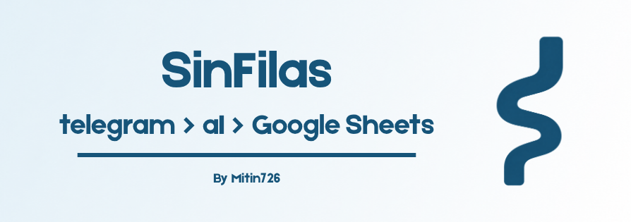

# SinFilas — Bot de Telegram (Alba)
<br>
## ¿Qué es esto?

Este es el asistente virtual de Telegram que hice para el proyecto **SinFilas**. Le puse el nombre de **Alba**. Su propósito es sencillo: ayudar a las personas a consultar si un medicamento está disponible **antes** de ir hasta una farmacia o centro de salud, para evitar que hagan largas filas y terminen descubriendo, después de esperar, que el medicamento no estaba disponible.

La idea nació pensando sobre todo en personas adultas mayores o con movilidad reducida, que muchas veces son las más afectadas por desplazamientos innecesarios y tiempos de espera largos.

## ¿Cómo funciona?

1. El usuario le escribe a Alba por Telegram, en lenguaje natural, algo como *"¿tienen ibuprofeno?"* o *"cuánto cuesta el acetaminofén"*.
2. El mensaje se envía a la API de Claude (Anthropic), que **no genera una respuesta libre**, sino que analiza el mensaje y devuelve solo un JSON pequeño con la intención (`intent`) y el medicamento mencionado. Esto lo hice así a propósito para ahorrar tokens de la API: Claude solo hace la tarea de "entender", nunca redacta el texto final.
3. Con esa información, busco el medicamento en una base de datos (Google Sheets), usando *fuzzy matching* (comparación aproximada de texto) para que funcione aunque el usuario no escriba el nombre exacto o tenga errores de tipeo.
4. Armo la respuesta final con plantillas de texto predefinidas en el código (no con la API), mostrando disponibilidad, presentación, precio, laboratorio y stock.

## Tecnologías usadas

- **Python 3.11+**
- **python-telegram-bot** — para conectar y manejar el bot de Telegram
- **anthropic** (SDK oficial) — para la interpretación de lenguaje natural con Claude
- **gspread + google-auth** — para conectar con Google Sheets como base de datos
- **rapidfuzz** — para la búsqueda flexible de nombres de medicamentos
- **python-dotenv** — para el manejo de variables de entorno/secretos

## Qué se necesita para que el bot funcione

### 1. Variables de entorno (archivo `.env`)

Hay que crear un archivo `.env` en la raíz del proyecto con:

```
TELEGRAM_BOT_TOKEN=tu_token_de_botfather
ANTHROPIC_API_KEY=tu_api_key_de_anthropic
GOOGLE_SHEETS_ID=id_de_tu_google_sheet
```

- El **token de Telegram** se obtiene creando un bot con [@BotFather](https://t.me/BotFather).
- La **API key de Anthropic** se obtiene desde la consola de [Anthropic](https://console.anthropic.com).
- El **ID de Google Sheets** es el que aparece en la URL de la hoja de cálculo.

### 2. Credenciales de Google (archivo `credentials.json`)

Se necesita un archivo `credentials.json` de una Service Account de Google Cloud con acceso a la Google Sheets API y Google Drive API habilitadas, y con la hoja de cálculo compartida con el correo de esa cuenta de servicio.

### 3. La base de datos (Google Sheet)

Una hoja de cálculo con las siguientes columnas exactas en la primera fila:

| nombre | presentacion | precio | stock | laboratorio |
|---|---|---|---|---|

### 4. Instalar dependencias

```bash
python3 -m venv venv
source venv/bin/activate    # En Windows: venv\Scripts\Activate.ps1
pip install -r requirements.txt
```

### 5. Correr el bot

```bash
python main.py
```

Mientras este proceso esté corriendo, el bot responde en tiempo real a cualquier persona que le escriba por Telegram, sin importar desde qué dispositivo lo haga. Si el proceso se detiene (se cierra la terminal, se apaga el equipo, etc.), el bot deja de responder.

## Estado actual del proyecto

Este es un **prototipo funcional**, pensado para demostrar el concepto. Actualmente corre de forma local (no está desplegado en un servidor 24/7), así que solo responde mientras alguien lo tenga corriendo manualmente. El siguiente paso natural sería desplegarlo en un servicio como Railway o Render para que esté disponible de forma permanente.

## Estructura del proyecto

```
bot-medicamentos/
├── main.py              # Punto de entrada del bot y los handlers de Telegram
├── claude_client.py     # Interpretación de lenguaje natural con la API de Claude
├── sheets_client.py     # Conexión y búsqueda en Google Sheets
├── respuestas.py         # Plantillas de respuesta predeterminadas
├── config.py            # Carga de variables de entorno
├── credentials.json     # Credenciales de la Service Account de Google (no se sube a git)
├── .env                  # Variables de entorno (no se sube a git)
└── requirements.txt      # Dependencias del proyecto
```

Made with ❤️ by Mitin726